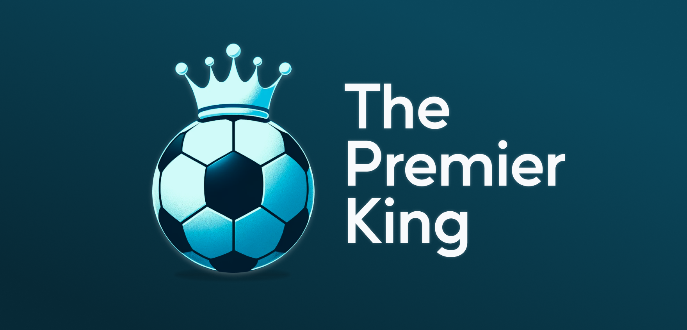
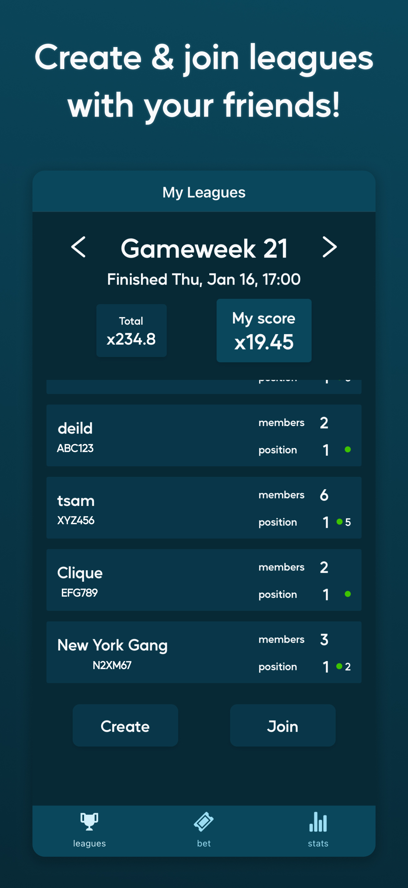
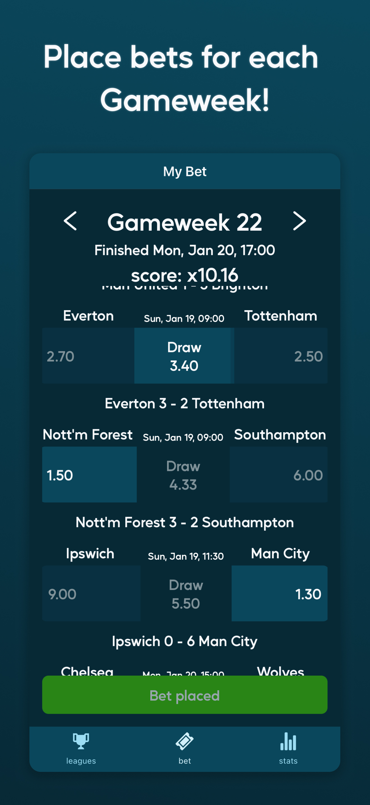
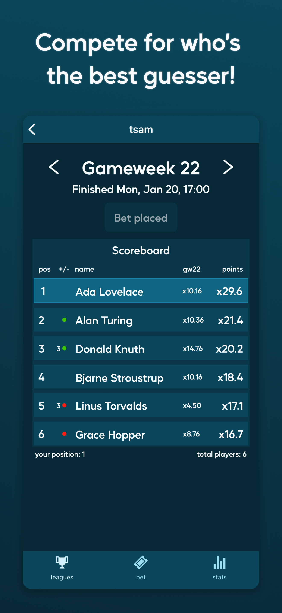

# PremKing

  
  
  

## About

_PremKing_ is a full-stack mobile application where friends create leagues, place bets on Premier League fixtures and compete for who's the best guesser!

Fixtures are split into Gameweeks, and users must place bets on a per-Gameweek basis.

Users bet on fixture results: either Home, Draw or Away, and if correctly guessed, are awarded with points determined by the betting odds of that result.

Points are accumulated into a total score over gameweeks, and the friend with the highest score by the season's end wins the league!

## Technology

The frontend is built using React-Native, using TypeScript and [Redux](https://redux.js.org/) for state management. It is built and deployed through [Expo](https://expo.dev/), which feels a little like magic.

The backend is created using [Gin](https://gin-gonic.com/), a Go framework, with [Gorm](https://gorm.io/) as an _orm_. Hosted on AWS under [api.premking.net](https://api.premking.net).

A PostgreSQL database is hosted by Supabase, which offers a suprisingly generous free-tier.

## Development

**For instructions on how to setup the project locally visit both the [frontend README](./frontend/README.md) & [backend README](./server/README.md)**
